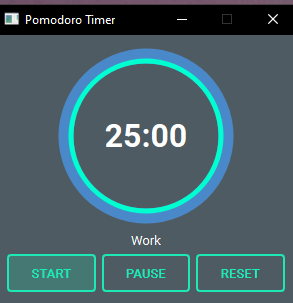

# 🍅 Pomodoro Desktop App

A modern cross-platform desktop Pomodoro timer built with Python and PyQt6.

Designed as a lightweight desktop widget for focused work sessions, clean UI, and seamless background usage.

---

## ✨ Features

* ⏱️ 30 / 10 Pomodoro workflow
* ▶️ Start / Pause / Reset controls
* ⭕ Circular progress widget
* 🔔 Audio notification on session completion
* 📌 System tray integration
* 🔄 Minimize to tray on close
* 👆 Click tray icon to show / hide application
* 🍅 Custom application icon
* 🖥️ Cross-platform support:

  * Windows
  * macOS
* 🌙 Dark theme UI

---

## 📸 Screenshot



---

## 🛠️ Tech Stack

Built with:

* Python 3.11+
* PyQt6
* qt-material

---

## 📂 Project Structure

```text
pomodoro-app/
│
├── main.py
├── circular_timer.py
├── requirements.txt
├── README.md
├── .gitignore
│
├── assets/
│   ├── screenshot.png
│   ├── icon.png
│   └── ding.wav
│
├── build/        # local only
├── dist/         # local only
└── venv/         # local only
```

---

## 🚀 Installation

Clone repository:

```bash
git clone https://github.com/YOUR_USERNAME/pomodoro-app.git
cd pomodoro-app
```

Create virtual environment.

### Windows

```bash
python -m venv venv
venv\Scripts\activate
```

### macOS / Linux

```bash
python3 -m venv venv
source venv/bin/activate
```

Install dependencies:

```bash
pip install -r requirements.txt
```

---

## ▶️ Running the App

```bash
python main.py
```

---

## 📦 Build Executable

Using PyInstaller:

```bash
pip install pyinstaller
```

Build:

```bash
pyinstaller --onefile --windowed main.py
```

Output:

```text
dist/
```

---

## 🖱️ Tray Controls

Right-click the tray icon for quick actions:

* Start
* Pause
* Reset
* Exit

Left-click the tray icon to show or hide the application.

Closing the window sends the app to the system tray instead of exiting.

---

## 🔮 Roadmap

* [ ] Native desktop notifications
* [ ] Session statistics
* [ ] Task tracking
* [ ] Persistent settings
* [ ] Custom work / break durations
* [ ] Auto-start next session
* [ ] Click-to-start directly on circular widget

---

## 🤝 Contributing

Ideas, improvements, and feedback are welcome.

Feel free to open an issue or submit a pull request.

---

## 📄 License

MIT License

---

## 👨‍💻 Author

Built by Stelian Radu.
